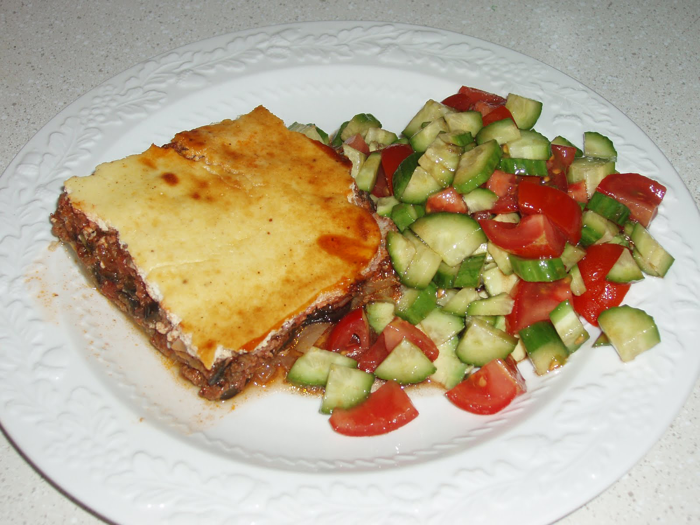

There are variations on this basic recipe, sometimes with no sauce, sometimes with other vegetables. The most common variant in Greece may include zucchini (courgette), part-fried potatoes or sautéed mushrooms in addition to the eggplant.

## Ingredients

- 1 kg aubergines (large or/and elongated variety)
- 160 ml vegetable oil (about 1 teacup)
- ½ large onion, finely sliced
- 450 grams minced beef
- 1 glass white wine (not retsina, but aretsinoto)
- 350 grams fresh tomatoes,
- 1400 grams tomatoes, drained of some of their juice and chopped
- teaspoon ground cinnamon
- teaspoon ground allspice
- salt and black pepper
- 1 teaspoon oregano
- 25 grams grated Parmesan, Kefalotiri, or Gruyere cheese
- some chopped parsley
- 80 grams butter
- 80 grams flour
- 600 ml warm milk
- 30 grams grated Parmesan or Gruyere cheese
- 2 egg yolks
- 4 tablespoons toasted breadcrumbs

## Method

Moussaka should be baked in the oven. Use a roasting container, either square or oblong, approximately 25 x 25 cm or 39 x 28 cm. It is recommended that you spread the work involved over two days for your convenience; one can easily cook the meat the day before, without the Moussaka suffering at all. Do not do the same with the aubergines; they should be fried on the day.

Top and tail the aubergines, without peeling them. Rinse them, cut them lengthways in 75-mm thick slices and immerse them in salted water, for 30 minutes. Take them out, squeeze gently, rinse, then squeeze them again. Drain them in a colander and pat dry. Fry them in hot vegetable oil until they become pale golden on both sides; you can either deep-fry them, which is easier but they absorb a lot of oil, or shallow-fry them. In either case, drain them on absorbent paper on a flat platter before serving, so that most of their oil will dribble away.

Sautee the sliced onion in 2 tablespoons vegetable oil, until it looks glistening. Add the meat and sauté together, stirring, until all the lumps are broken down and the meat starts to change colour. Pour in the wine, add tomatoes, sliced finely, the spices, salt and pepper and the oregano. Cover and cook for 20 minutes, stirring from time to time in case it sticks. Then mix in the grated cheese and parsley.
Melt the butter and, away from the heat, gradually add the flour and stir to amalgamate. Return to the heat and gradually add the milk and seasoning, stirring continuously. Simmer for 9-10 minutes, stirring, until it has thickened considerably. Withdraw the pan from the heat, let it stand briefly, then add the cheese and the egg yolks. Stir to amalgamate them. Do not let the sauce boil after this.

It should by now be a thick béchamel, to enable it to sit on top of the meat mixture and form a kind of crust.

To assemble, cover the base of the roasting dish with half of the fried aubergines, then spread half of the meat mixture evenly on top of them and cover neatly with the remaining aubergines. Spread the remaining meat and sauce evenly over the top and cover neatly with the béchamel sauce. Sprinkle the grated cheese all over the top, and the breadcrumbs. Moussaka from Macedonia may contain a layer of thinly sliced round potatoes which have been fried first. Bake in a pre-heated oven, gas no.4/ 350 grades F/ 180 grades C, for 1 hour, until a golden crust is formed all over the top. Let it stand for 5 minutes before serving, in order to be able to cut it more easily. To serve, cut into square or oblong-shaped pieces, about 8 cm thick. It should be quite dry by then and the pieces should ideally stay intact.

- Serves: 6
- Preparation time: 1 hour
